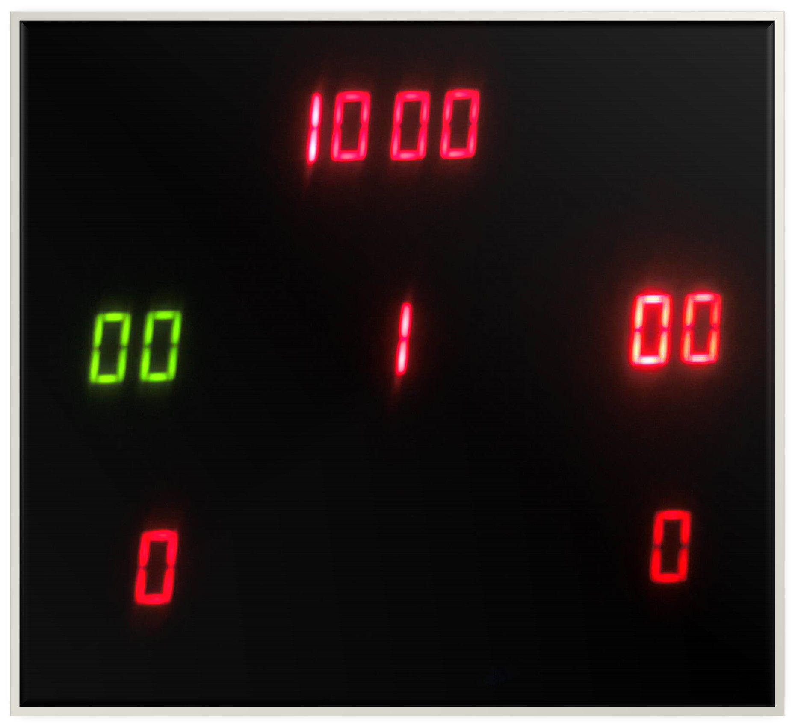
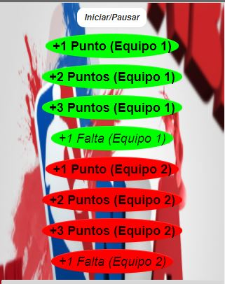
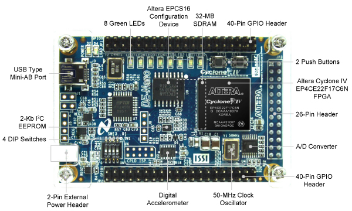

# baskcoreboard
Basketball scoreboard design in VHDL to work in a DE0 NANO FPGA, data is received through an UART Port:

This basketball scoreboard has the logic to play basketball games working through serial signals.

# Communication table

| Action        | ASCII code           |
| :-------------: |:-------------:|
| Start/Pause      | 'b' |
| Increase 1 Point team 1      | 'd' | 
| Increase 2 Points team 1      | 's'      |  
| Increase 3 Points team 1 | 'a'      |
| Increase fault team 1  | '3'      | 
| Increase 1 Point team 2      | 'p' | 
| Increase 2 Points team 2      | 'o'   |  
| Increase 3 Points team 2 | 'l'    | 
| Increase fault team 2 | '4'      | 

# How to use?

- Load the board in Quartus Altera 13+ program

- Syntethize the design in your FPGA assigning the inputs and outputs.

A demo app to use the system in Android phones through bluetooth using an HC-05 module can be found here: [Basketball APP](mobile_app/baskcoreboard.apk)

# VHDL code was tested in a DE0 nano FPGA

Pin layer can be found in the project scheme

## Materials

- 11 x 7 Segment displays connected to multiplex
